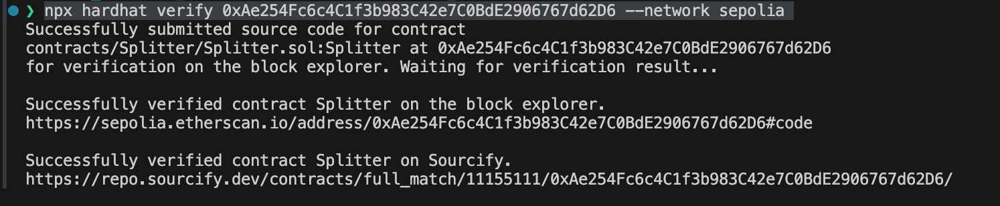

# hardhat_demo
hardhat usage demo

# 准备工作
. 安装hardhat
```shell
yarn init -y
yarn add --dev hardhat
```
. 初始化仓库,一路回车即可
```
npx hardhat init
```

. 根据错误提示，有可能需要安装这些组件
```
npm install --save-dev "@nomicfoundation/hardhat-ignition-ethers@^0.15.0" "@types/mocha@>=9.1.0" "ts-node@>=8.0.0" "typescript@>=4.5.0"
```
. 安装其它需要组件
```shell
yarn add --save-dev @openzeppelin/contracts dotenv
```
. 设置package.json中的参数
  - solidity 版本信息
  - 合约要发布的网络信息
  - 合约校验时必须的区块浏览器的key

. 将合约部署到链上

```shell
npx hardhat run ./deploy/Lock.js --network localhost
```
```
npx hardhat ignition deploy ./ignition/modules/Lock.js --network localhost
```

. 交合约发到链上进行验证
```
  npx hardhat verify 0xAe254Fc6c4C1f3b983C42e7C0BdE2906767d62D6 --network sepolia
```



# 常用命令
```shell
    npx hardhat init
    npx hardhat compile
    npx hardhat test
    npx hardhat run
    npx hardhat node
```
# 使用缩定命令,npx hardhat  缩写为hh, 需要安装一个插件
```shell
    npm install --global hardhat-shorthand
```

# dotenv的替代者
```
hh vars path 变量存储位置 
hh vars setup
hh vars set API_KEY
```

# 自定义task 
> 在hardhat.config.js中 添加task


### 可以使用Fork进行合约测试


